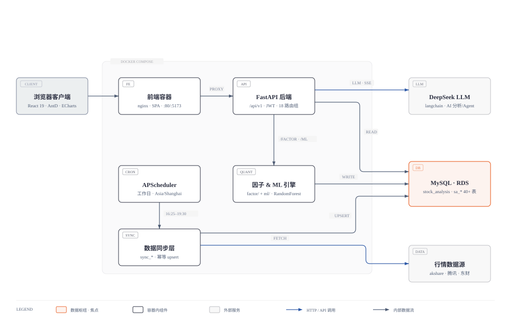
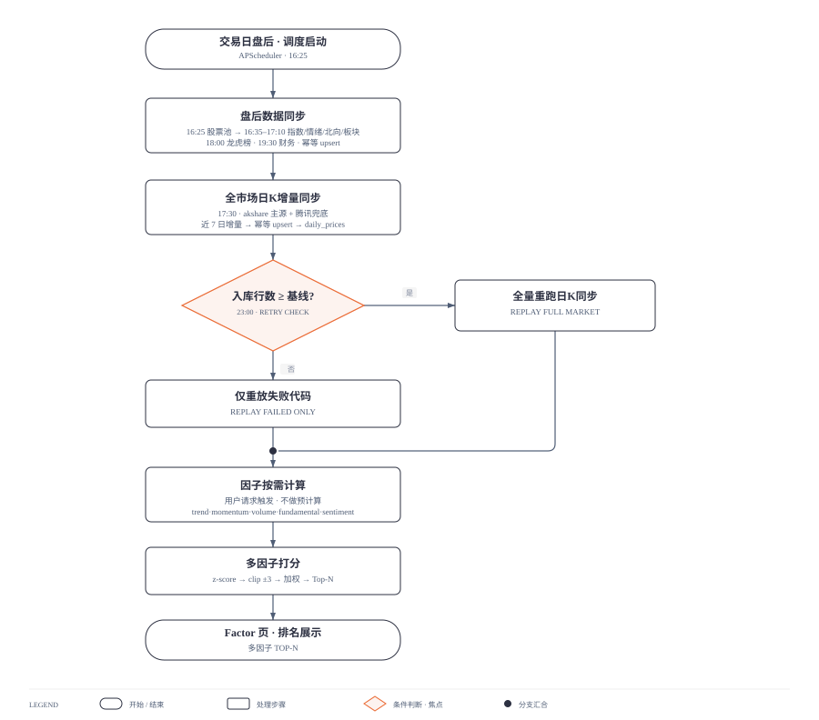
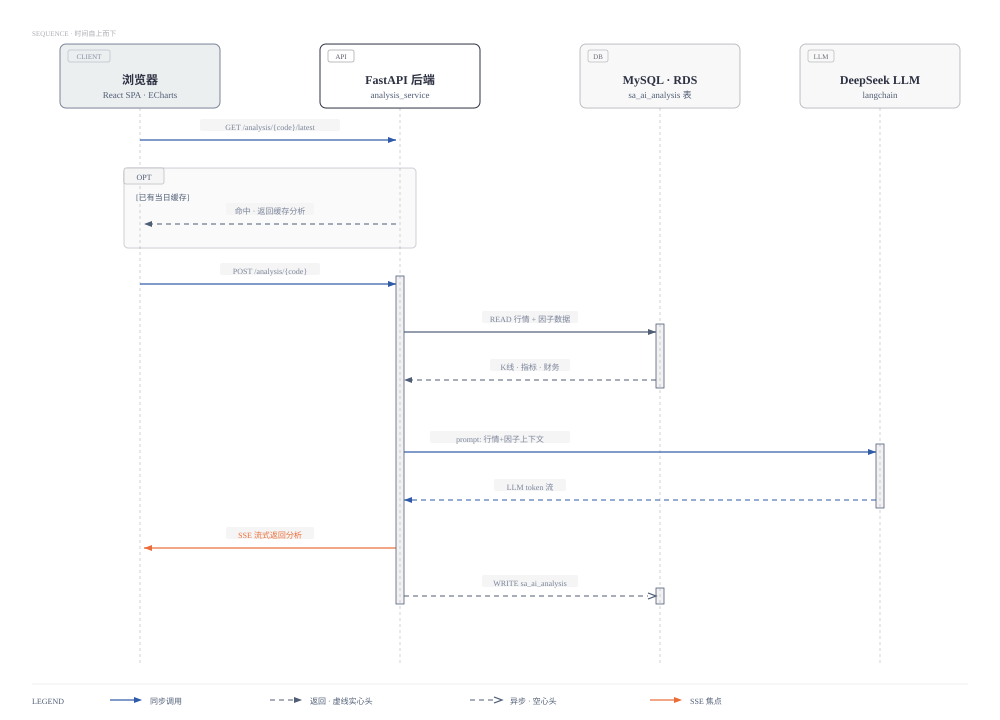

# stock-platform 图集

平台的三张核心图：静态结构（架构图）、批处理管线（流程图）、运行时交互（时序图）。图片为矢量 SVG，可缩放查看。

## 系统架构



- 浏览器 React SPA 经 nginx 前端容器代理（PROXY）调用 FastAPI 后端（`/api/v1` · JWT）。
- 虚线分区为 docker-compose 内的 5 个组件：前端容器、FastAPI、APScheduler、数据同步层、因子 & ML 引擎。
- MySQL（阿里云 RDS，`stock_analysis` · `sa_*` 40+ 表）是全平台唯一数据枢纽，READ / WRITE / UPSERT 三条链路汇入。
- 蓝色箭头为对外部服务的 HTTP 调用：DeepSeek LLM（AI 分析 / Agent）与行情数据源（akshare · 腾讯 · 东财）。

## 交易日盘后数据管线



- 16:25 起调度器依次同步股票池与盘后数据（指数 / 情绪 / 北向 / 板块 / 龙虎榜 / 财务）。
- 17:30 对全市场做日K增量同步：akshare 主源 + 腾讯兜底，幂等 upsert。
- 23:00 自愈检查（橙色焦点）：入库行数远低于基线则全量重跑，否则仅重放失败代码。
- 数据就绪后因子按需计算（用户请求触发、不做预计算），经多因子 z-score 加权打分，在 Factor 页展示 Top-N。

## 个股 AI 分析 · 时序



- 主流程：`POST /analysis/{code}` → FastAPI 读库取行情 + 因子 → 组装 prompt 调 DeepSeek → token 流返回 → SSE 流式推给浏览器（橙色焦点）→ 异步写 `sa_ai_analysis`。
- OPT 片段：先查 `GET /analysis/{code}/latest`，已有当日缓存则直接返回，不走 LLM。
- 消息语义：实线为同步调用，虚线实心头为返回，虚线空心头为异步。

---

## 素材与同步

| 文件 | 说明 |
|---|---|
| `*.html` | 编辑排版版原稿（浏览器打开，字体与版式最完整） |
| `*.svg` | 画板适配版，即本文档引用的图片源 |
| `*-preview.jpg` | 飞书画板导出的验证预览，可删除 |

这三张图已同步到飞书文档「画板测试」并可在画板中在线编辑。SVG 源更新后，一条命令覆盖同步对应画板：

```bash
lark-cli whiteboard +update --whiteboard-token <token> --input_format svg \
  --source @docs/diagrams/<file>.svg --overwrite --as user
```
